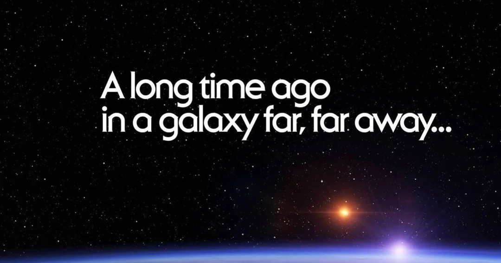
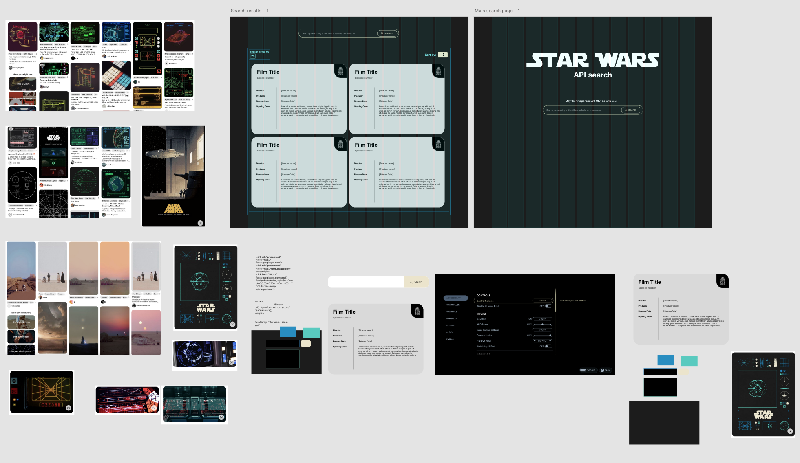
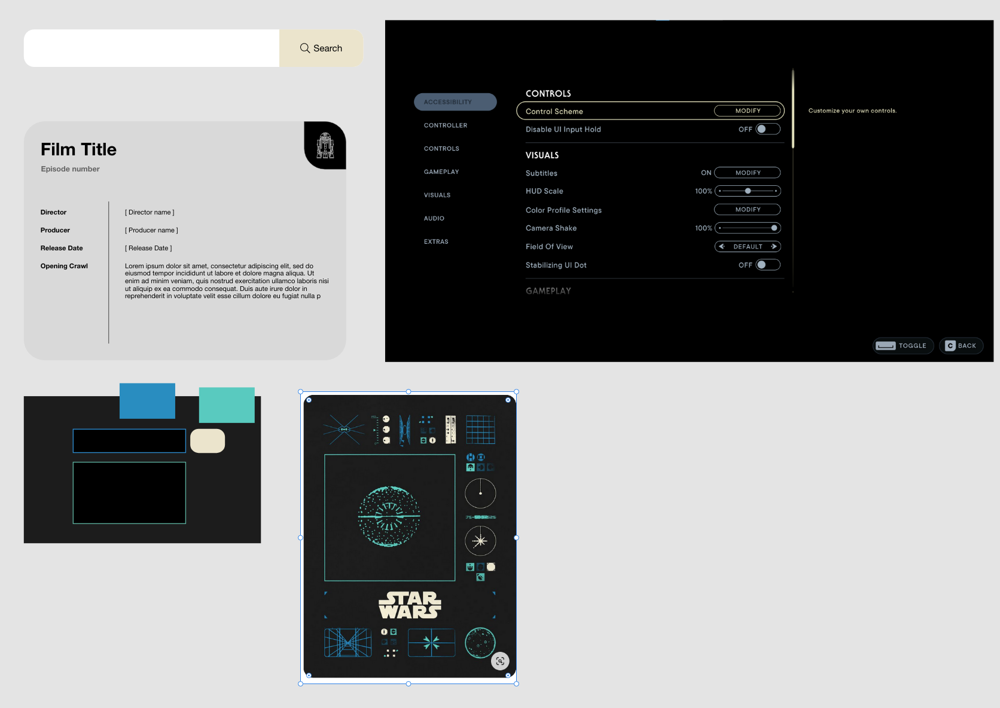
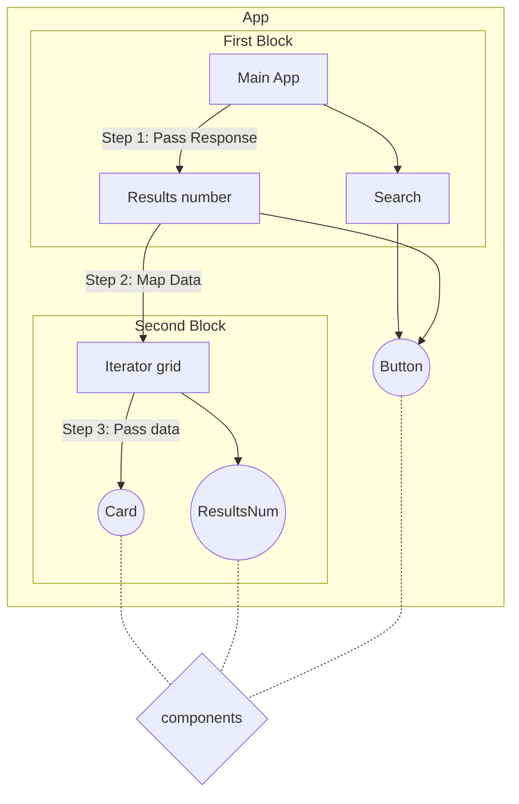

# Front-end project

This repository contains the source code for the App().

Live demo available on Vercel [here](https://starwars-api-search-app.vercel.app/).

## Design / Concept

While it wasn't necessary I wanted to add a personal touch to this fun project. Rather than having a plain app, I wanted to add a bit of the Star Wars aesthetic to it. I first took the \*.fig file and designed it in Adobe XD as I don't have a Figma paid version, so I couldn't get the exact pixel numbers for dimensions (paddings,margins,width, etc).

After some thought and quick testing with different colours I decided to choose these colours and aesthetic. A big influence was the UI from a StarWars video game. I trust the artists who made that UI!!

Design file [here](https://xd.adobe.com/view/62a43562-60cb-494b-af17-9baa94caa400-37f7/screen/2ef31ecc-c06b-499d-b545-9d477cb9d028/specs/).

## Implementation

Components tree:

### Components

buttons.tsx is reusable and offers the following functionalities:

- have two versions
- take svg icons (as react components inline SVGs)
- take classes if we want to specify from the parent
- accepts a function from the parent to call when clicked
- can have types button/submit/reset
- hide text, for cases when we need just an icon
- It can toggle between states, by accepting an array of objects, useful when you have a button that toggles between on/off states, this is used for the sorting functionality

card.tsx is a reusable component, implemented as per \*.fig file. It offers the following functionalities::

- take classes to specify from the parent
- has a main and a secondary title
- take an array of rest of the content. I did this as the listed content grows and shrinks per category.

resultsNumber.tsx is reusable and offers the following functionalities:

- Just take a number to display the number of the results
- It doesn't have too many options since there was no scope to be used flexibily rather is a fixed component used to display info/data

iteratorGrid.tsx is reusable and offers the following functionalities:
Its role is to process and structure the data for rendering within the card. It take an array of data and then with a map function we _map_ the right information to the correct component in a way the component wants it. The iterator is used to iterate through an extra step or interface before rendering the card. Ideally, I would want to have some extra documentation on what the iterator requires in terms of input types..

resultsComponent.tsx
Just takes the **resultsData** and any classes. ResultData comes as it is from the fetching function and then uses a function **comformData** to change the data to a **readable** structure/format so the iteratorGrid can iterate and render them. Results component was meant to also have an `<aside>` bar to display filtering options. Since it takes the data raw, it can perform all operations.

### comformData.js

This function purpose is to restructure the given information into a consistent format so we can be the used by the iterator. It takes an array of objects called `dataInput`
Defines mappings for the main/secondary titles and content using TypeScript
Creates an empty array to store (and later `return`) the formatted results.

How it works:

1. It iterates through each object from `dataInput`
2. For each iteration it creates a newObject
3. For each iteration it loops through the keys and
   3a. Checks and matches the main and secondary title based on the mappings
   3b. Checks and pulls the rest of the content (ignores those we don't need) to add into `newObj.content`
4. Once all keys are processed the new objects get pushed into the new array

### space-animation.js

Is a script taken here from - https://codepen.io/ybensira/pen/byYNBZ

The idea behind it was when we wait for the API to connect and then pull all the information we show a warp animation, rather than a plain background.
There was the intention to display an looped animation of an SVG file to show the loading.
